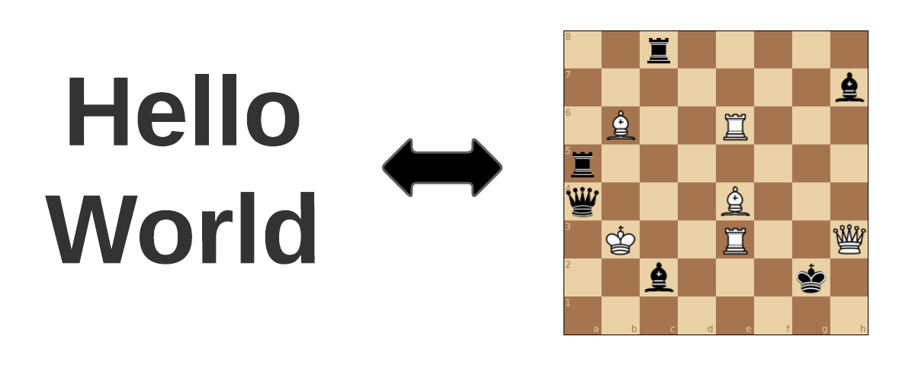

# chesscode



Are you a spy that needs to leave an urgent top secret message for an incoming foreign diplomat but the only thing in the consulate's parlor is a chessboard?  Chesscode was created for just this purpose. 

Chesscode is a way of encoding messages using a chess board and the starting set of chess pieces.  The message can be up to 23 alphanumeric characters also allowing spaces and periods.  A web client to encode / decode messages cane be found at:

https://notnil.github.io/chesscode/

Valid Charset (space at end):
```
0123456789ABCDEFGHIJKLMNOPQRSTUVWXYZ. 
```

## Demo


