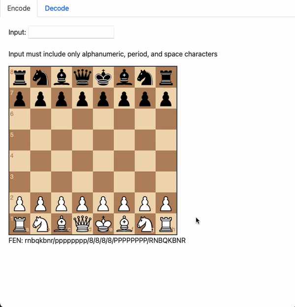
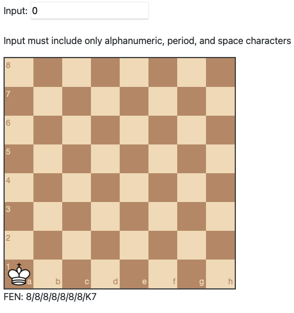
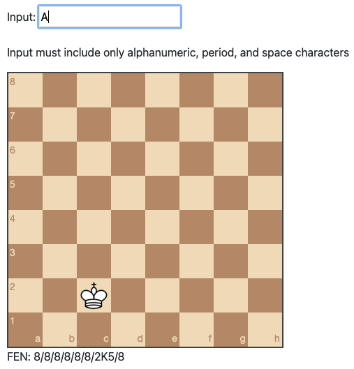
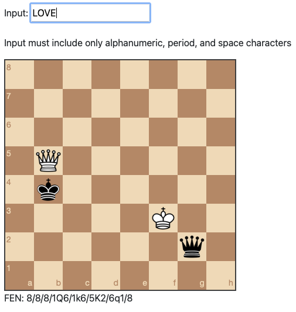
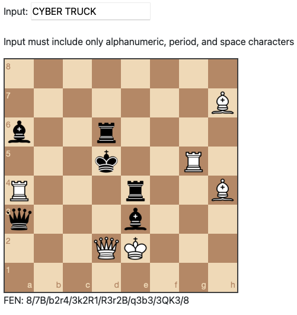
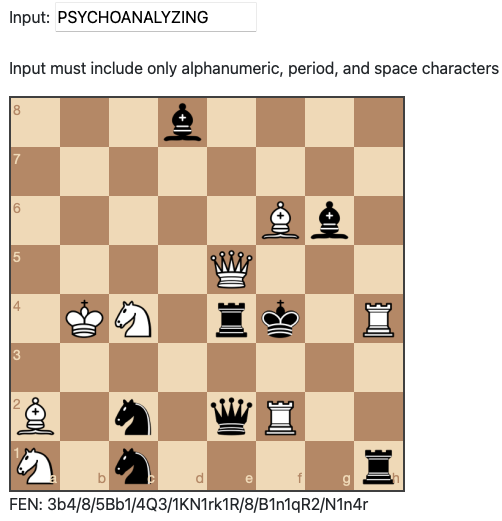
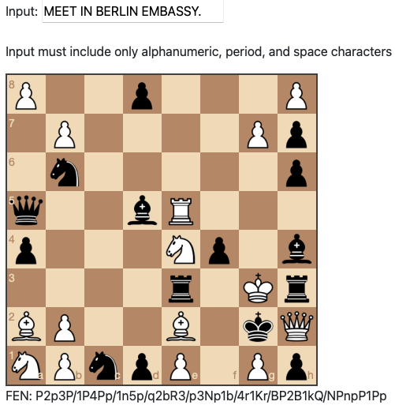

# chesscode


Are you a spy that needs to leave an urgent top secret message for an incoming foreign diplomat but the only thing in the consulate's parlor is a chessboard?  Chesscode has you covered. 

Chesscode is a way of encoding messages using a chess board and the starting set of chess pieces.  The message can be up to 23 alphanumeric characters also allowing spaces and periods.

## Demo Video



## Web Encoder / Decoder

The web encoder / decoder is hosted with Github Pages using the static assets in the /docs directory.  Notably this library is converted to WebAssembly using [Go's compiler support](https://github.com/golang/go/wiki/WebAssembly) and includes the [notnil/chess](https://github.com/notnil/chess) package.


https://notnil.github.io/chesscode/

## Methodology

Chesscode has a few primary objectives:
- Use a subset of the starting pieces (so it can be used in person)
- Encode as much alphanumeric text as possible
- Disallow ambiguous encodings and decodings

### Encoding

Since the set of possible pieces is fixed as a subset of the starting position, this infinitely limits the theoretical possibilities of 13^64 configurations.  Another issue is piece distribution, there is one white king and eight white pawns for example.  Because of these constraints, pieces signify the order of data and squares hold the data itself.

*Piece Order*
- White King
- Black King
- White Queen
- Black Queen
- White Rooks
- Black Rooks
- White Bishops
- Black Bishops
- White Knights
- Black Knights
- White Pawns
- Black Pawns

This pattern is easiest to see with the white king.  The first example with the king in the A1 square encodes 0, while the king in the C2 encodes A.  The square simply indexes a character in the charset.  This gets us one character.     

Charset (space at end):
```
0123456789ABCDEFGHIJKLMNOPQRSTUVWXYZ. 
```




Once a square is used, it can't be used again.  For the black king, white queen, and black queen characters are encoded in the index of the remain squares. This gets us four characters total.     



Continuing the pattern of simply using square indexes for pieces with multiple copies would result in ambiguous results (which white rook is first).  To combat this, piece combinations are indexed.  White rooks, black rooks, white bishops, and black bishops encode to two characters using their combination index.  Because these pieces must encode two characters in combination, input strings are filled to spaces to appropriate size. This gets us twelve characters total.



Knights, due to diminishing squares, don't have enough combinations to encode two characters per color.  Knights are therefore combined and encode three characters. This gets us fifteen characters total.



The number of combinations of eight pawns into the forty eight squares remaining is too large to calculate and index in a reasonable time frame.  Therefore pawns of the same color are split up into two groups, left and right, occupying the A-D and E-H files respectively.  Four pawns on half the board can encode two characters each.  With white and black pawns on the left and right side get us to twenty three characters total.  



### Decoding

Decoding simply reverses the encoding process, but there is a few caveats:
- Not every board with the starting pieces can be decoded
- It is ambiguous if the message intended to leave white space at the end of the message

Both of these caveats are acceptable.  Firstly the only positions of use are ones previous encoded, so positions which can not be decoded just reflect the fact that there are unused positions which is a better trade off than not being able to represent all input text.  Secondly white space at the end of the message rarely conveys semantic meaning and can be safely ignored.  